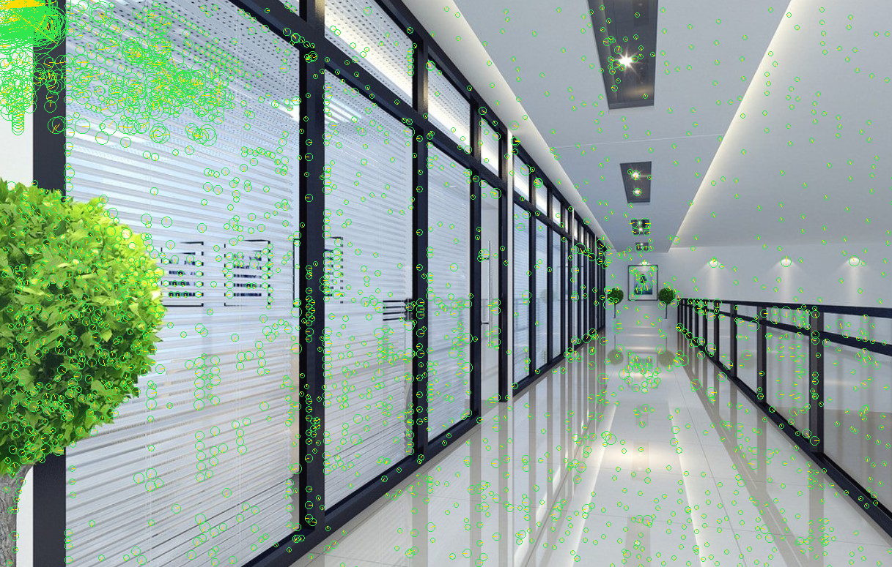

# sift-rs
A from-scratch implementation of Scale-Invarint Feature Transform (SIFT) paper from Lowe (2004)

## Usage

Run the CLI with an input image and optional output path:

```bash
cargo run --bin sift -- <input_image> [output_image]
```

## Example

```bash
cargo run --bin sift -- assets/corridor.jpg assets/out.png
```

This reads `assets/corridor.jpg`, detects SIFT keypoints, and writes the annotated result to `assets/out.png`.

<p align="center">
  
  
</p>
